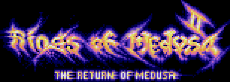
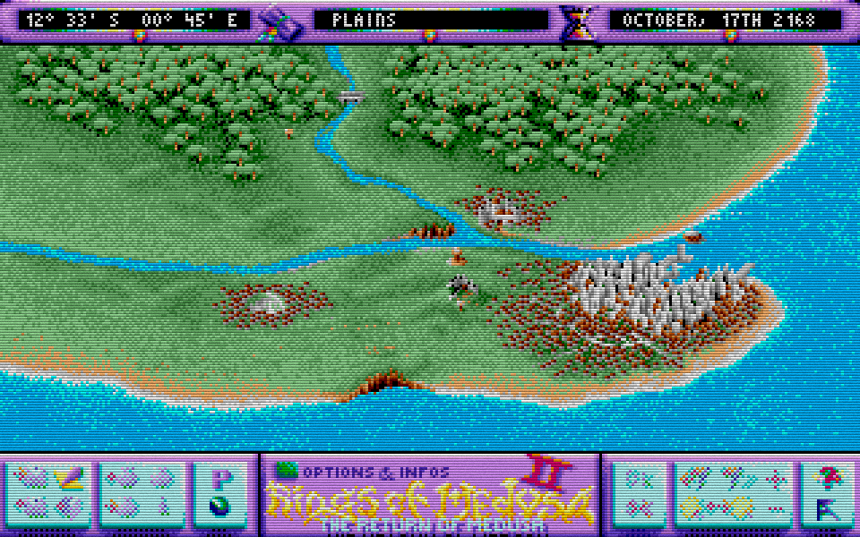
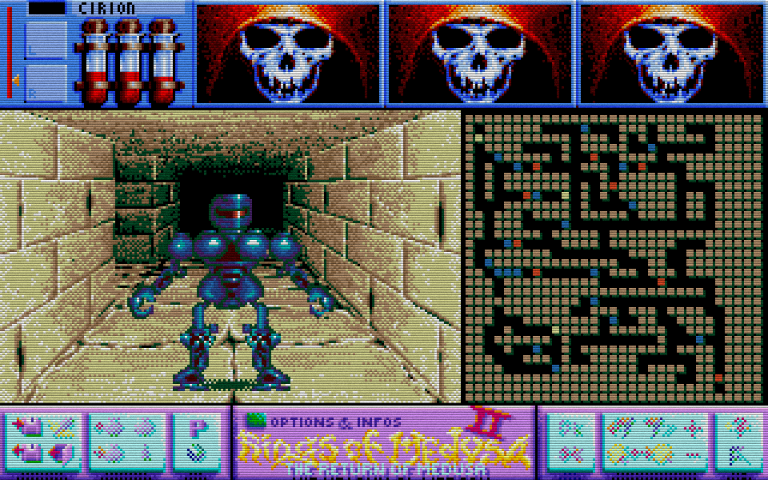

# Rings of Medusa 2
also known as Return of Medusa

Source code written by Tilmann "Till" Bubeck and all artwork done by Thorsten Zimmermann.

This is the source code of the original Atari ST/Amiga game from 1991 together with all needed graphics and sound data. It has been published for historical reasons, if someone wants to get insights into former game development.
The game is mostly written in C with some assembler routines to speed up the code. Everything was developed and done on an Atari ST, even the Amiga version. I used TurboC and TurboAss for compiling and mostly NEOchrome Master for the images.

In addition to the original (unmodified) source code, I ported the game to modern systems by using SDL3. You can compile and run the game on modern Windows and Linux systems. This port is "quick and dirty" meaning, that there are memory leaks and probably untested and even malfunctional code. However, it is completely playable and I have not found any issues.

The repository has various tags for various stages.

 * ["original-sources"](../../tree/original-sources): This tag is for the original unmodified source codes from 1991.
 * ["utf8"](../../tree/utf8): all source codes and text files are converted to UTF-8 to make them easily readable.
 * ["png"](../../tree/png): all images in *.NEO or *.IFF format are also available as PNG to make them accessible.
 * ["sdl3-2025-10-15"](../../tree/sdl3-2025-10-15): Changes to the original files for use on modern systems.

Have fun looking at old code for an old machine!

Tilmann Bubeck, 2025-10-15

